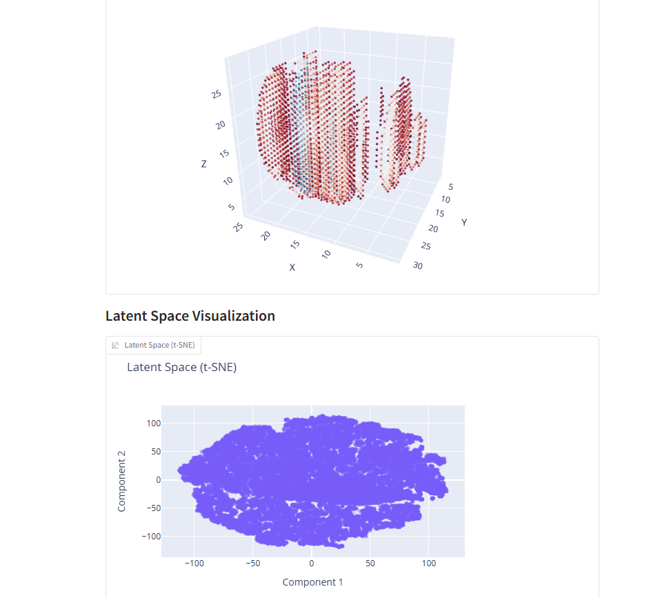

# EEG2Scan: Experimental EEG Imaging System

**EEG2Scan** is an experimental system that transforms EEG data into 3D brain activity scans using AI models. This tool is intended for research and experimental purposes only and should not be used for medical diagnosis or treatment. I bugged Claude AI until it became reality. I am not a expert at all. 

# Installation

Ensure you have Python 3.7 or higher installed. Install the required libraries using pip:

pip install numpy torch mne scipy tqdm gradio plotly h5py scikit-learn psutil

# Usage

python EEGAIMODELMAKER.py 

Process EEG data, train the autoencoder model, and extract hidden vectors. I tried it with single 
7 channel edf file. It might have trouble with different channels. 

# Scan Visualization

Generate and visualize 3D brain activity scans from the trained model and hidden vectors.

python EEGSCAN.py

If the process works it takes a while for the visualizations to appear. You can also save them 
by defining a save folder. For some reason the 2d representation does not show in that. 

# Disclaimer

EEG2Scan is an experimental EEG imaging system and has not been validated for medical use. Do not rely on its outputs for clinical or diagnostic purposes.

# Licence

MIT 
